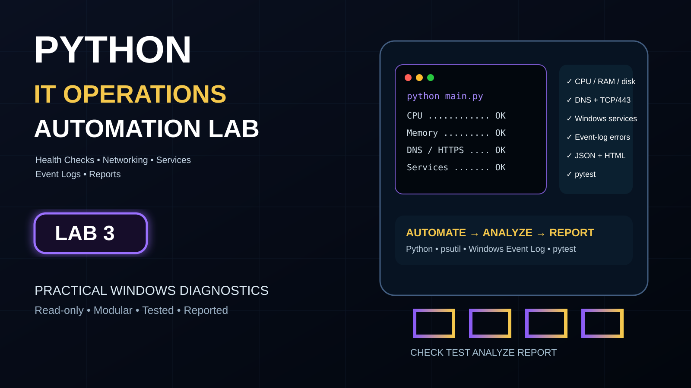
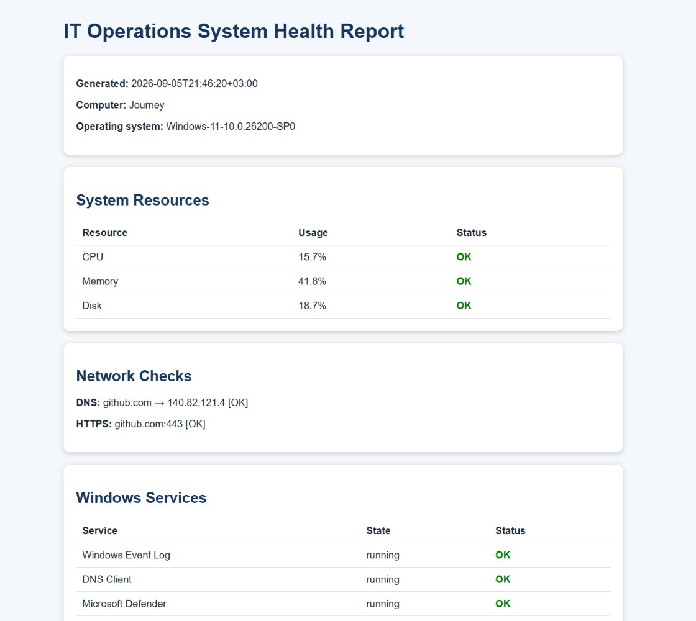
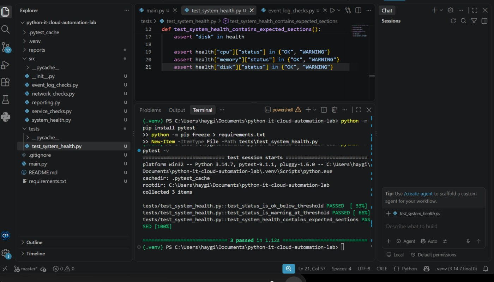

# Python IT Operations Automation Toolkit



A Windows-focused Python automation toolkit that performs system health checks, validates network connectivity, monitors essential Windows services, reviews recent event-log errors, and generates JSON and HTML reports.

## Features

- CPU, memory, and disk utilization monitoring
- 80% resource warning threshold, defined in `src/system_health.py`
- DNS resolution testing
- TCP port 443 reachability testing (does not validate TLS or HTTP responses)
- Windows service monitoring
- Windows Application event-log error detection
- Timestamped JSON reports
- Styled HTML reports
- Configurable command-line options
- Automated tests with pytest

## Project Structure

```text
python-it-cloud-automation-lab/
├── main.py
├── requirements.txt
├── src/
│   ├── event_log_checks.py
│   ├── network_checks.py
│   ├── reporting.py
│   ├── service_checks.py
│   └── system_health.py
├── tests/
│   └── test_system_health.py
├── evidence/
│   ├── system-health-report-preview.jpg
│   └── pytest-results-preview.jpg
└── reports/
    ├── sample-report.html
    └── sample-report.json
```

## Installation

Create and activate a virtual environment:

```powershell
py -m venv .venv
.\.venv\Scripts\Activate.ps1
```

Install the required packages:

```powershell
python -m pip install -r requirements.txt
```

## Usage

Run with the default settings:

```powershell
python main.py
```

Run with a custom network target and event-log period:

```powershell
python main.py --target microsoft.com --event-hours 12
```

Available options:

- `--target` selects the hostname used for DNS and TCP/443 tests.
- `--event-hours` selects 1–8760 hours of Windows Application events to inspect.

## Generated Reports

Each execution creates:

- A JSON report for automation and further processing
- A styled HTML report for human review

Portfolio samples:

- [Sample HTML report](reports/sample-report.html)
- [Sample JSON report](reports/sample-report.json)

## Evidence

### Generated HTML system health report



### Automated test results



## Automated Tests

Run the test suite:

```powershell
python -m pytest -v
```

The original screenshot records the initial three-test suite. CI now also covers event-log failures and input validation; check the latest run for current results.

## Technologies

- Python
- psutil
- pytest
- PowerShell
- Windows Event Log
- Git

## Security and Safety

The toolkit performs read-only diagnostic checks. It does not modify services, event logs, network settings, or system configuration.

## Skills Demonstrated

- Python scripting and modular project design
- Windows systems administration
- Resource and service monitoring
- DNS and TCP connectivity troubleshooting
- Event-log analysis
- JSON and HTML report generation
- Command-line interface development
- Automated testing
- Git version control

## Related portfolio labs

[Lab 1: Linux support & troubleshooting](https://github.com/ozangirginwork-wq/linux-it-support-troubleshooting-lab) · [Lab 2: Windows Server & Active Directory](https://github.com/ozangirginwork-wq/windows-server-active-directory-lab) · [Lab 4: AWS security incident investigation](https://github.com/ozangirginwork-wq/aws-security-incident-response-lab) · [Lab 5: Secure Terraform & CI security](https://github.com/ozangirginwork-wq/terraform-cicd-pipeline) · [Lab 6: AWS automated incident response](https://github.com/ozangirginwork-wq/aws-security-automated-incident-response)

The event-log check distinguishes an empty result from a query failure. Access failures or missing PowerShell produce `FAILED` with an unknown count. Windows CI runs the regression suite; local tests mock event-log access and do not prove access to a real Windows event log.
