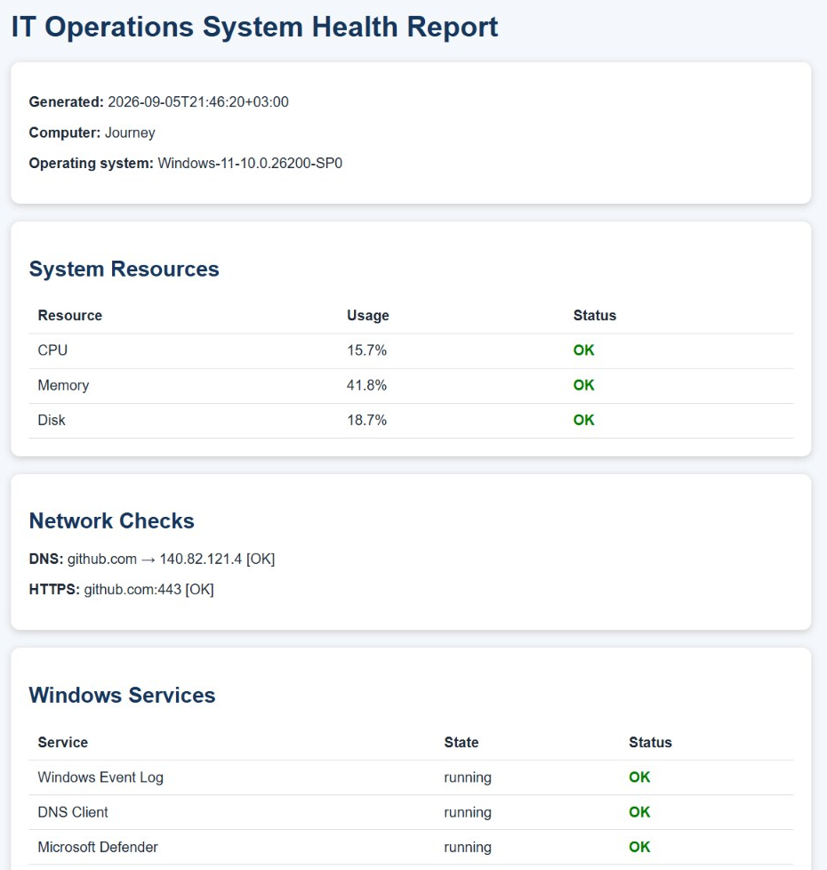
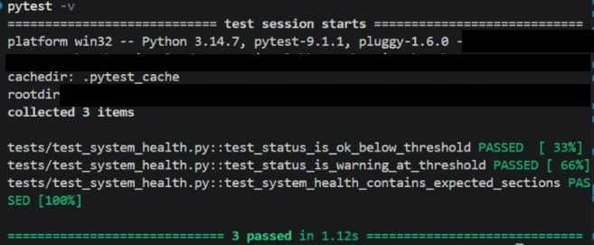
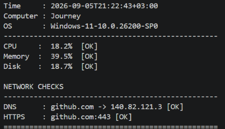

# Evidence highlights

Three focused views from the original lab work, curated on September 25, 2026. These are historical captures, not new test runs or proof of a currently deployed environment.

The images are cropped to the relevant output. Solid black blocks mark redacted identifiers; commands and results have not been rewritten. Local lab names, private addresses and public service endpoints are retained where useful.

## 1. HTML health report

The original HTML report displays resource use, DNS/TCP checks and Windows service states. The historical HTTPS label means TCP/443 reachability, not a TLS or HTTP test.

## 2. Original pytest results

The original Windows test run collected three tests and reported three passed. This is the initial suite, not the current expanded test count.

## 3. Command-line resource and network checks

The original CLI output reports CPU, memory and disk status plus successful DNS and TCP/443 checks. These are historical readings, not current machine measurements.

## Source and integrity notes

Crops were reviewed for readability and sensitive data before publication. Hashes below identify the published crops, not the unedited sources. Existing source captures elsewhere in the repository are retained.

| Published crop | SHA-256 |
| --- | --- |
| `01-html-health-report.png` | `5fab8c10922c7179b56e3e720e94308e12b72a272765282a66b28a091296ef04` |
| `02-original-tests.png` | `886a75f708560fefcc9bcabfcf7e84ddc8530599cd78886d2be8389b059e1101` |
| `03-cli-health-checks.png` | `221baf845902f5471d30357e5fcd31d5bb50fffc4ba2fbc2b53ccaa4c2d9bc28` |

[Back to project](../../README.md)
